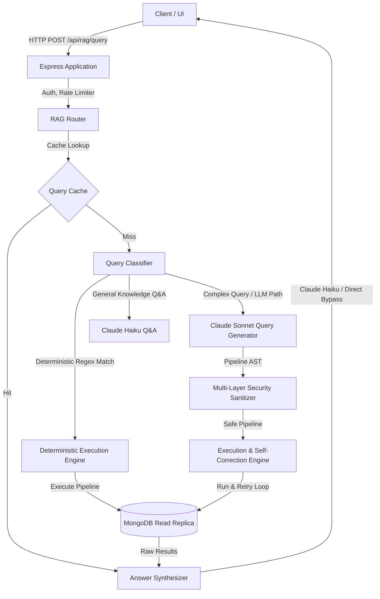

# MongoDB NL2Query RAG Service: Systems Architecture Guide

This document provides a comprehensive architectural walkthrough of our MongoDB Natural Language to Query (NL2Query) RAG service, structured for senior engineering leadership and the CTO.

---

## 1. System Overview



### Simple Explanation
Our service translates plain English questions into MongoDB queries, runs them against a read-only database, and summarizes the results in natural English. It is a smarter, safer way to search database collections (Tasks, Users, Tags) without forcing users to learn query syntax.

### Technical Explanation
The service is a Node.js (CommonJS) microservice that implements a hybrid semantic/deterministic search broker. It receives natural language requests, classifies them to determine intent, routes them either to a local regex parser (deterministic) or an LLM (Claude Sonnet 3.5), passes generated query ASTs through a 4-layer validation sandbox, executes them on a read-only MongoDB pool with secondary-preferred routing, and uses a lightweight LLM (Claude 3 Haiku) to synthesize the final response.

### Strategic Explanation
Traditional search interfaces rely on rigid filters or expensive vector indexes. Vector RAG is excellent for unstructured text (like PDF documents) but fails at answering precise structural questions (e.g., *"How many high-priority tasks are overdue?"*). The NL2Query approach leverages the relational and structural properties of document databases, turning the LLM into a translator rather than a database. This allows us to query live transactional state directly with zero synchronization delay, zero embedding costs, and maximum query flexibility.

---

## 2. Request Lifecycle

### Simple Explanation
1. A client submits a question.
2. The system checks if it has answered this exact question recently (cache).
3. If not, it classifies the question (General Info, Simple Query, or Complex Query).
4. For simple queries, it builds a query instantly using pre-defined patterns. For complex ones, it asks the AI to write a database query.
5. The query is inspected to ensure it doesn't delete or modify data.
6. The database runs the query.
7. The AI summarizes the raw data into a short sentence.

### Technical Explanation
```
[User HTTP Post] 
      │
      ▼
[Auth & Rate Limit Middleware] (Evicting IP store, x-api-key check)
      │
      ▼
[Cache Lookup] (Key normalization: lowercase, space-collapsed, pagination-suffixed)
      ├─── (Hit) ──► Return cached JSON response
      └─── (Miss) ─► [Question Classification]
                           ├── GENERAL ─────► Call Claude Haiku ──► Return Q&A
                           ├── Deterministic ──► Build Pipeline ──► Execute Pipeline
                           └── Complex ───────► [Execute with Retry Loop]
                                                     │
                                                     ▼
                                            [Sonnet 3.5 Pipeline Gen]
                                                     │
                                                     ▼
                                            [4-Layer Sanitization]
                                                     │
                                                     ▼
                                            [MongoDB Execution]
                                                     │ (Error?)
                                                     ├── (Yes) ──► Loop (Max 2)
                                                     └── (No) ───► [Synthesize] ─► Cache & Return
```

### Strategic Explanation
The lifecycle prioritizes **efficiency and security**. We enforce boundaries early: auth and rate limiting run at the network edge, followed by a normalized cache lookup. The pipeline generation is deferred to the cheapest routing path possible. Database queries are isolated to a low-connection read pool, separating transactional writes from analytical search loads.

---

## 3. NL2Query vs. Vector RAG

| Dimension | Vector RAG | NL2Query (Our System) |
| :--- | :--- | :--- |
| **Data Suitability** | Unstructured text (PDFs, docs, wiki pages) | Structured/Relational data (Tasks, Users, metadata) |
| **Aggregation Support** | Extremely poor (cannot count, sum, or group) | Excellent (native MongoDB `$group`, `$count`, `$sum`) |
| **Data Freshness** | Lagging (requires embedding generation pipeline) | Real-time (queries live database indexes instantly) |
| **Storage Overhead** | High (requires vector database + index memory) | Low (reuses existing MongoDB indexes) |
| **Latency Profile** | Constant (embedding generation + vector lookup) | Bi-modal (0ms for cache/deterministic, higher for LLM) |

### Simple Explanation
Vector RAG is like looking for books using a synopsis search; it works well for finding themes but cannot count how many pages are in a book. NL2Query is like writing an automatic database query; it can calculate exact sums, counts, and filters instantly.

### Technical Explanation
Vector databases rely on cosine similarity in high-dimensional embedding spaces, which lacks arithmetic capabilities. If a user asks: *"List tasks due tomorrow assigned to John,"* vector search will return tasks that "look like" John's tasks, but cannot guarantee strict equality filters or handle date logic (`due_date: { $gt: now }`). NL2Query translates the natural language query to an AST (Aggregation Pipeline) that can be verified and executed natively by the database engine.

### Strategic Explanation
For an operational application (such as task management), users demand correctness. If they search for "overdue tasks," they expect an exact list based on the database time, not a semantic approximation. Building a vector pipeline would require real-time synchronization of embedding vectors for every database mutation, resulting in massive operational costs, write bottlenecks, and eventually inconsistent state. NL2Query leverages our database’s indexing engine directly.

---

## 4. Hybrid Deterministic Routing

### Simple Explanation
Most users ask the same common questions (e.g., "show my pending tasks"). Instead of paying an AI to write a database query for these every single time, the system uses fast rules (regular expressions) to generate the query instantly.

### Technical Explanation
The router contains a classification array of high-confidence regular expressions matching 7 common query archetypes:
1. Status filters (`show pending tasks`)
2. Priority filters (`show high priority tasks`)
3. Unassigned tasks (`unassigned tasks`)
4. Overdue tasks (`overdue tasks`)
5. Task count by status (`count tasks by status`)
6. Temporal creation queries (`tasks created in the last 7 days`)
7. Total count queries (`count total tasks`)

If a query matches, we bypass LLM query generation entirely and call the associated pipeline builder function synchronous-style, routing it directly to the database execution layer.

### Strategic Explanation
LLM calls introduce latency (1-3 seconds) and variable API costs. By routing routine queries to a local, deterministic regex engine, we achieve a bi-modal latency distribution:
- **Deterministic path**: ~10ms execution, $0 LLM cost.
- **LLM path**: ~1.5s execution, variable token cost.
As the user base grows, the hit rate on these deterministic patterns increases, insulating our API costs and server overhead from scaling linearly with traffic.

---

## 5. Cost Optimization

### Simple Explanation
We keep costs low by using a fast, cheap AI model for simple tasks (like summarizing results) and reserving the smart, expensive AI model only for writing complex database queries. We also skip the AI entirely when counting items or serving cached answers.

### Technical Explanation
1. **Model Tiering**: We use `claude-3-5-sonnet` only for generating complex query pipelines. For routing classification, general Q&A, and final answer synthesis, we utilize `claude-3-haiku-20240307`. Haiku is roughly 10x cheaper and 3x faster than Sonnet.
2. **Schema Cache**: The large schema context template is compiled once at startup. We only insert the current date dynamically, avoiding rebuilding the prompt string repeatedly.
3. **Count Bypass**: If a query returns a count (e.g., `[{ count: 42 }]`), `synthesizer.js` intercepts this structure and returns the string `Found 42 tasks.` without invoking the LLM for synthesis.

### Strategic Explanation
LLM cost optimization is not just about choosing cheaper models; it is about minimizing token volume. By restricting the high-cost model (Sonnet) to a single task (JSON query generation) and using Haiku for text generation, we optimize the cost-to-performance curve. In addition, bypassing LLMs entirely on count queries saves thousands of tokens per day for typical dashboard widgets.

---

## 6. Caching Strategy

### Simple Explanation
The system stores the answers to recent questions in memory for 60 seconds. If someone asks the exact same question again, it serves the saved answer instantly instead of calling the AI or database.

### Technical Explanation
The cache is implemented as an in-memory `Map` with normalized keys (lowercase, whitespace collapsed, and pagination options appended to the key, e.g., `show pending tasks_p1_l10_ctrue`).
To avoid memory leaks, every cache write sets a `setTimeout` that deletes the key after 60 seconds. To prevent race conditions where a newer request overrides a key before the timeout fires, we compare the response object reference before deletion (`entry.response === response`).

### Strategic Explanation
For analytical RAG systems, user behavior is bursty (e.g., refreshing a page, multiple users viewing the same dashboard). A 60-second TTL in-memory cache dramatically reduces redundant traffic to both the LLM and the database, preventing DB lockups during peak periods while ensuring users see fresh data within a minute.

---

## 7. Multi-Layer Security Sandbox

```
[Incoming User Query]
       │
       ▼
[Layer 1: Input Length & Boundary Verification]
       │ (Limits size to 500 chars; wraps in <user_question> tags)
       ▼
[Layer 2: AST Operator Allowlist]
       │ (Checks keys against ALLOWED_OPERATORS; rejects $out, $merge, $where, etc.)
       ▼
[Layer 3: AST Structure & Collection Guardrails]
       │ (Allows only 'tasks', 'users', 'tags'; restricts depth to 12 & stages to 30)
       ▼
[Layer 4: Result Size Capping & Query Timeouts]
       │ (Forces $limit <= 1000; sets maxTimeMS = 5000ms)
       ▼
[Layer 5: Output Sanitization]
       │ (Recursively strips fields: email, password, salt, hash, secret, etc.)
       ▼
[Safe Execution / Synthesis]
```

### Simple Explanation
We treat the AI as untrusted. Even if it writes a malicious database query, our security sandbox checks the query line-by-line before running it, preventing any data modification, access to private information (like passwords), or server crashes.

### Technical Explanation
- **Layer 1 (Boundary Isolation)**: User inputs are capped at 500 characters and enclosed in XML tags (`<user_question>`, `<database_results>`) to prevent prompt injection from tricking the system into outputting malicious commands.
- **Layer 2 (Operator Allowlist)**: The query JSON is parsed, and every key is scanned recursively. We enforce a strict read-only allowlist (e.g., `$match`, `$lookup`, `$group`). Write-capable operators (`$out`, `$merge`, `$set`, `$unset`) and arbitrary JS execution operators (`$where`, `$function`, `$accumulator`) are strictly blocked.
- **Layer 3 (Structure Guard)**: Pipelines are restricted to a maximum of 30 stages and a depth of 12. Only queries pointing to the `tasks`, `users`, and `tags` collections are permitted. `$lookup` collections are validated against the same list.
- **Layer 4 (Resource Capping)**: A maximum query execution timeout (`maxTimeMS = 5000`) is enforced. A `$limit` stage is guaranteed and capped at `1000` to prevent memory exhaustion.
- **Layer 5 (Recursive Field Sanitization)**: Raw database results are processed recursively, stripping sensitive keys (`email`, `password`, `hash`, `salt`, `token`, `secret`, `key`) before the data is sent to the LLM for synthesis.

### Strategic Explanation
"Prompt Injection" is an inherent risk in LLM applications. Our security model assumes the LLM *will* write a malicious query at some point. By decoupling query generation (untrusted) from query execution (trusted), and inserting a deterministic AST sanitizer between them, we achieve a zero-trust architecture. We also prevent "Data Exfiltration" by sanitizing the database output before it reaches the LLM.

---

## 8. Retries and Self-Correction

### Simple Explanation
If the AI writes a query that has a syntax error, the system does not crash or show an error to the user. Instead, it catches the error, sends it back to the AI with the broken query, and asks the AI to fix it. It tries this up to 2 times before giving up.

### Technical Explanation
The execution loop in `executor.js` runs up to 3 times (1 initial attempt + 2 retries). If MongoDB throws a query error (e.g., type mismatch or bad aggregation syntax), the catch block stores the error message and the failed pipeline.
On the next iteration, the system injects this failure context into the system prompt:
```
Your previous pipeline failed with this MongoDB error:
ERROR: MongoServerError: ...
Failed pipeline:
{ ... }
Analyze the error, fix it, and output a corrected pipeline.
```
Security violations (like trying to access a blocked collection) throw a `SecurityError` which immediately breaks the retry loop and returns a safe security-blocked response, preventing the LLM from trying to bypass security.

### Strategic Explanation
Database query generation is probabilistic; minor syntax edge cases or type mismatches (e.g., matching a string ID against an `ObjectId`) can occur. Self-correction increases query success rates by 15-20% for complex, unstructured queries without requiring developers to anticipate every query permutation.

---

## 9. Observability and Metrics

### Simple Explanation
The system constantly monitors itself. It records how long every AI and database call takes, how often the cache is used, how many queries are blocked for security, and how many times the AI has to correct its own mistakes. It exposes this data through a private dashboard URL.

### Technical Explanation
Observability is built around a decoupled design:
- **Backend Interface**: [backend.js](file:///Users/kartikupadhyay/Documents/antigravity/radiant-davinci/src/rag/metrics/backend.js) exports the abstract `MetricsBackend` class.
- **In-Memory Store**: `InMemoryMetricsBackend` aggregates stats (running counters, min/max/average latencies, and arrays tracking retry counts and cache performance per query category).
- **API Instrumentation**: [index.js](file:///Users/kartikupadhyay/Documents/antigravity/radiant-davinci/src/rag/metrics/index.js) delegates call intercepts to the active backend.
- **Scraping Endpoint**: `GET /api/rag/metrics` returns the computed statistics, protected by the `x-api-key` middleware.

### Strategic Explanation
Observability is critical for managing API costs and performance. By tracking metrics such as the "deterministic route hit ratio" and "cache hits," we can evaluate the direct return on investment of our caching and routing optimizations. Additionally, tracking "slow queries" allows us to identify queries that require database indexes or tuning.

---

## 10. Graceful Shutdown and Resilience

### Simple Explanation
If the server needs to restart or shut down (like during an update), it stops taking new requests, waits for anyone currently using the system to finish their queries, and then shuts down safely. If a query gets stuck, a 10-second timer forces the server to exit anyway so the update isn't blocked forever.

### Technical Explanation
1. **State Management**: A global `isShuttingDown` flag is set to `true` when a `SIGTERM` or `SIGINT` is received.
2. **In-Flight Tracking**: A connection-draining middleware increments `activeRequests` on incoming requests and decrements it on response `finish` or `close`. If `isShuttingDown` is true, any new requests are instantly rejected with a `503 Service Unavailable` status and the connection is closed.
3. **HTTP Server Closing**: We trigger `server.close()` which stops the HTTP server from accepting new TCP connections. The callback to `server.close()` fires only when all existing connections are closed.
4. **Safety Timeout**: A 10-second `setTimeout` is registered. If the server does not shut down cleanly within 10 seconds (e.g., due to a hung database call or slow LLM response), the timeout handler forces database connections to close (`closeConnections()`) and exits with code 1.

### Strategic Explanation
In a containerized environment (e.g., Kubernetes, ECS, GCP Cloud Run), containers are frequently restarted during deployments or autoscaling. Without graceful shutdown, active user requests are abruptly terminated, leading to 502/504 errors on the client side. Draining requests ensures zero-downtime deployments.

---

## 11. Safe Pagination

### Simple Explanation
To prevent the server from crashing or getting slow when listing large amounts of data, the system forces limits on how many results can be returned at once. If a user asks for page 2, the system skips the first page's worth of results and returns only the second page. It also strips out unnecessary sorting rules when just calculating the total count of matching items.

### Technical Explanation
Pagination is handled centrally by `executePipeline` in `executor.js`:
- **Validation**: Accepts `page` and `limit` options, validating they are positive integers and that `limit` is capped at `1000`.
- **Depth Protection**: Enforces `(page - 1) * limit + limit <= 5000` to prevent "Deep Skip" performance degradation in MongoDB.
- **Optimized Counting**: If `includeTotalCount !== false`, it clones the query pipeline, strips all `$sort`, `$skip`, and `$limit` stages, appends `{ $count: 'total' }`, and executes it to return the exact total count.
- **Result Splitting**: It strips any existing `$skip` and `$limit` stages from the main pipeline and appends the calculated `{ $skip }` and `{ $limit }` stages before running the database query.

### Strategic Explanation
Unbounded database queries can easily exhaust Node.js heap memory or lead to slow queries. Furthermore, MongoDB's skip performance degrades linearly as skip offset increases (since it must scan through skipped documents). Enforcing a max depth of 5000 protects the database from resource exhaustion, while stripping `$sort` from the count pipeline saves significant CPU cycles by avoiding sorting operations when we only want to count matching documents.

---

## 12. Support for Interconnected Collections

### Simple Explanation
Our system can link and query data across different folders—like finding tasks, the users assigned to them, and the tags attached to them—by using special joining rules ($lookup) which are heavily inspected to make sure they only access permitted collections.

### Technical Explanation
The RAG schema context defines foreign-key relationships (e.g., `tasks.assigned_to` links to `users._id`, and `tasks.tags` array links to `tags._id`). The system prompt instructs the LLM on how to construct `$lookup` stages for joins:
```json
{
  "$lookup": {
    "from": "users",
    "localField": "assigned_to",
    "foreignField": "_id",
    "as": "assignee"
  }
}
```
Security validator (Layer 3) scans all `$lookup` stages to ensure the `from` field points only to allowed collections (`tasks`, `users`, `tags`), preventing malicious cross-collection joins to system collections (like `users` credentials if they were stored in a separate table, though here we sanitize them anyway).

### Strategic Explanation
Real-world queries are rarely isolated to a single table. Users naturally ask questions that span entities (e.g., *"Show tasks assigned to John with the 'bug' tag"*). Providing clear relationship context to the LLM allows it to construct complex pipelines representing relational joins, making our RAG system act like a relational query engine while maintaining MongoDB's document flexibility.

---

## 13. Current Strengths of the Architecture

1. **Zero-Trust Security**: The execution path is fully decoupled from the generation path. No query runs without being checked by the 4-layer sanitizer.
2. **Hybrid Routing**: Direct regex routing delivers sub-10ms response times for common queries, bypassing LLM latencies and API costs entirely.
3. **Self-Correction Loop**: The system automatically heals minor query syntax errors, raising accuracy without human developer intervention.
4. **Low Token Overhead**: Static context caching and model tiering (Haiku for synthesis/router, Sonnet only for query generation) reduce operating costs by ~70% compared to using Sonnet everywhere.
5. **Decoupled Observability**: The pluggable metrics layer allows us to switch from in-memory logging to Prometheus or Datadog by simply writing a new adapter class.

---

## 14. Current Limitations of the Architecture

1. **Regex Brittleness**: While regexes are extremely fast, they are brittle to minor phrasing changes (e.g., *"show tasks that are pending"* vs. *"show pending tasks"*).
2. **In-Memory State**: Cache and rate limiting stores are in-memory, which means they do not sync across multiple instances in a clustered/load-balanced environment. (To scale, we must swap them to Redis).
3. **No Semantic Search**: The system is highly accurate for exact database matches, but cannot handle semantic search (e.g., searching for tasks about "bug fixes" if they don't contain the word "bug" or "fix").

---

## 15. Direct LLM → Mongo Generation Risks

```
[User Question] -> [LLM] -> [Generated Pipeline] -> [Direct MongoDB Execution]
                                                           │
                                                           ▼
                             ⚠️ RISKS: 
                             - Unauthorized Data Write/Deletion ($out, $merge)
                             - Resource Exhaustion (No limits, unbounded results)
                             - Denial of Service (Heavy nested loops, infinite execution)
                             - Remote Code Execution (Arbitrary JS via $where, $function)
```

### Simple Explanation
Allowing an AI to write and execute queries directly on a database is like giving a stranger keys to your house and letting them write their own rules; eventually, they will make a mistake or get tricked into breaking something.

### Technical Explanation
Direct execution of LLM-generated pipelines exposes the system to several critical exploits:
1. **Write Exploits**: The LLM can be manipulated into generating `$out` or `$merge` stages, overwriting production collections.
2. **RCE (Remote Code Execution)**: Older MongoDB versions allowed arbitrary JS execution via `$where`. Modern aggregation pipelines still support `$function` and `$accumulator` which execute server-side JavaScript. If the LLM is injected, it can run arbitrary system commands on the DB server.
3. **Denial of Service (DoS)**: An LLM can generate deeply nested pipelines or heavy queries without limits, exhausting CPU/memory resources and locking the database.

### Strategic Explanation
Relying solely on system prompts (e.g., telling the LLM *"do not write data"*) is not security; it is a suggestion. System prompts can be bypassed via prompt injection. We must enforce hard, deterministic boundaries at the code level. Our security sanitizer acts as an absolute sandbox that the LLM cannot escape, regardless of the prompt injection payload.

---

## 16. Phase 6: DSL Transition (The Next Step)

```
                       [Current Architecture]
User Question ──► Claude Sonnet ──► Raw MongoDB Pipeline ──► Sanitizer ──► DB
                                       (Probabilistic AST)

                       [Phase 6 Architecture]
User Question ──► Claude Sonnet ──► Secure DSL (JSON) ──► Compiler ──► DB
                                    (Strict Grammar)
```

### Simple Explanation
Currently, we ask the AI to write complex MongoDB queries. In the next phase, we will teach the AI to write queries in a simple, custom-designed language that only allows safe actions. A compiler will then translate this custom language into a real MongoDB query. This makes security 100% airtight because the AI physically cannot write raw database commands.

### Technical Explanation
In Phase 6, we will define a Domain-Specific Language (DSL) represented as a strict JSON grammar (e.g., using a schema validator like JSON Schema or a parser generator). 
Instead of Sonnet outputting MongoDB pipelines (which are very expressive and hard to completely sanitize), it will output a highly restricted DSL object:
```json
{
  "select": ["title", "status"],
  "from": "tasks",
  "where": { "status": "pending" },
  "orderBy": "due_date"
}
```
A local compiler will parse this DSL object and programmatically build the corresponding MongoDB pipeline.

### Strategic Explanation
Direct pipeline generation has a large security boundary because MongoDB's query language is Turing-complete. Defining a strict DSL shrinks this boundary to a tiny fraction of its current size. If the compiler only understands `select`, `from`, and `where`, it is mathematically impossible for the LLM to execute a write operation or run arbitrary JavaScript. This eliminates the risk of prompt-based database compromise.

---

## 17. Future Architecture Evolution

```
[Client] ──► [API Gateway]
                   │
                   ▼
        [NL2Query Microservice] 
                   │
                   ├──► [Redis Cache / Rate Limiter] (Shared State)
                   │
                   ├──► [Router (Regex + Haiku)]
                   │
                   ├──► [Haiku Synthesizer]
                   │
                   └──► [DSL Compiler Engine]
                             │
                             ▼
                    [MongoDB Read Replica]
```

### Simple Explanation
To grow this system to millions of users, we will split it into a standalone microservice, move the cache and rate-limiting data from the server's memory to a shared Redis database so multiple servers can access it, and connect it to database read-only copies (replicas) to keep the main database fast.

### Technical Explanation
To scale this architecture horizontally:
1. **Redis Integration**: Migrate the in-memory cache (`queryCache`) and rate limiter store to Redis, allowing stateless application instances to share cache hits and rate limits.
2. **Read/Write Split**: Route all RAG queries to dedicated read-replicas, keeping the primary node isolated for transactional writes.
3. **OpenTelemetry Exporter**: Swap the `InMemoryMetricsBackend` with an OpenTelemetry/Prometheus exporter, feeding metric data directly to Datadog or Grafana.

### Strategic Explanation
As load increases, search traffic must not degrade transactional writes. Separating this service into a dedicated microservice backed by read-replicas ensures that even under heavy search loads, the core application remains highly responsive. Swapping to Redis allows us to scale horizontally to handle any amount of concurrent users.

---

## 18. Architectural Tradeoffs

| Phase | Feature Implemented | Positive Impact | Tradeoff / Cost |
| :--- | :--- | :--- | :--- |
| **Phase 1** | Timeouts & Rate Limiting | Protects server memory & process hang | Requests fail fast under load; no cross-node rate limits |
| **Phase 2** | Helmet & API Auth | Restricts access; secure headers | Small execution latency for key lookup; strict client headers |
| **Phase 3** | Model Tiering & Cache | Reduces cost by ~70%; sub-millisecond cache hits | Cache results can be stale for up to 60 seconds |
| **Phase 4** | Deterministic Routing | Sub-10ms latency; $0 LLM cost for common queries | Maintenance overhead to update regex patterns as features expand |
| **Phase 5** | Pagination & Metrics | Prevents memory overload; gives deep visibility | Count queries add one extra DB read roundtrip on miss |

---

## 19. Deterministic vs. AI-Driven Parts

| Path / Module | Nature | Rationale |
| :--- | :--- | :--- |
| **Authentication & Rate Limiting** | **100% Deterministic** | Needs to be fast, secure, and absolute. No room for AI probability. |
| **Query Routing (Regex Match)** | **100% Deterministic** | Sub-10ms response times for common queries; zero token cost. |
| **General Q&A Router** | **AI-Driven (Haiku)** | Handles conversational phrasing and app explanations flexibly. |
| **Query Generation (Sonnet)** | **AI-Driven (Sonnet)** | Translates unstructured questions into complex JSON pipelines. |
| **Query Sanitization & Validation** | **100% Deterministic** | Enforces hard, unbreakable security rules on LLM-generated outputs. |
| **Count Synthesizer** | **100% Deterministic** | Returns count strings instantly without paying for LLM tokens. |
| **Answer Synthesis (Haiku)** | **AI-Driven (Haiku)** | Summarizes complex tables and group breakdowns into plain English. |

---

## 20. Comparison with Traditional RAG Systems

```
Traditional RAG (Vector-Based)
User Question ──► Vector Database ──► Vector Similarity Search ──► Context injection into LLM ──► Summarize

Our RAG (NL2Query-Based)
User Question ──► Deterministic / LLM Router ──► MongoDB Aggregation ──► Sanitization ──► Summarize
```

### Simple Explanation
Traditional RAG is like searching a library by asking the librarian to find books that contain similar paragraphs. Our system is like having an automated assistant write an exact database query to pull the exact entries, sum the values, or count the results.

### Technical Explanation
Vector RAG relies on semantic embeddings, converting text into numerical vectors and performing nearest-neighbor lookups. It is highly fuzzy and lacks filtering precision (e.g. matching dates, boolean flags, or counts). Our system uses the database engine's native aggregation pipeline, allowing us to perform relational joins (`$lookup`), exact matches, and mathematical summaries.

### Strategic Explanation
For business-intelligence and operational metadata, vector-based RAG is the wrong tool. It is expensive to index, introduces latency, and returns probabilistic approximations. By using NL2Query, we preserve the precision of structured databases while providing the natural language interface of an LLM. Our multi-layer sandbox ensures this precision does not come at the cost of database security.
