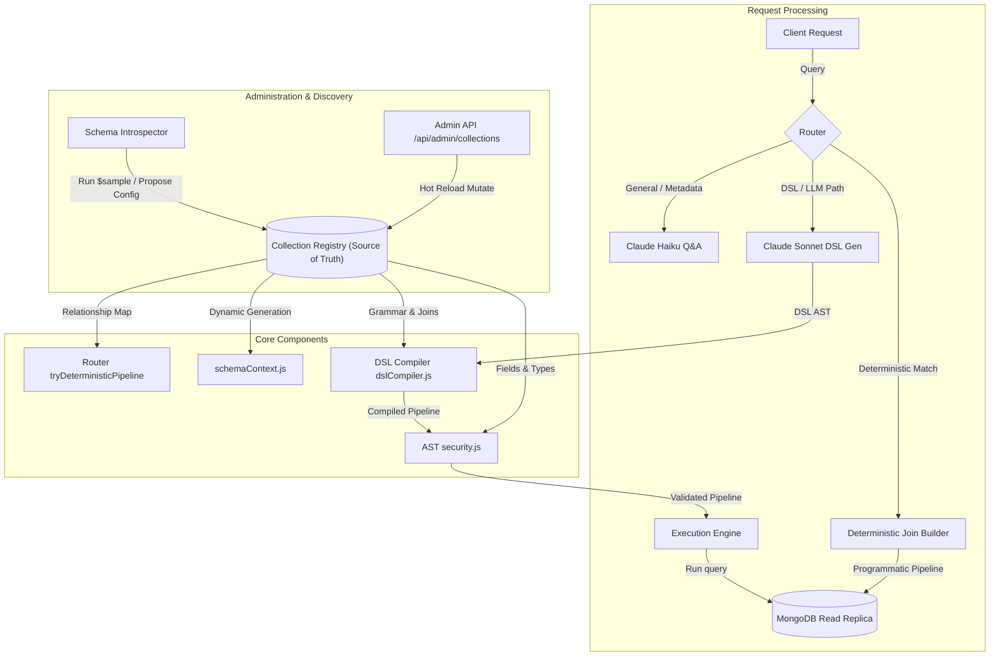

# RAG NL2Query Service: System Architecture 2.0 (Metadata-Driven Engine)

This document describes the design and evolution of **System Architecture 2.0**, moving our RAG service from a static, collection-specific configuration to a dynamic, metadata-driven query broker centered around a **Collection Registry**.

---

## 1. Architectural Philosophy: The Metadata-Driven Shift

In Architecture 1.0, the schema configuration is hardcoded and spread across three modules:
1. Prompt instructions in `schemaContext.js`
2. `ALLOWED_COLLECTIONS` and `$lookup` guards in `security.js`
3. Regex matching rules in `router.js`

Adding a new collection (e.g., `projects`) requires manual updates across all three files, introducing high risk of configuration drift and security gaps.

**Architecture 2.0** resolves this by consolidating all schema, relationship, and routing rules into a single source of truth: the **Collection Registry**. Every other system component reads from this registry at runtime.



---

## 2. Deep Dive: The 7-Phase Architecture Evolution

### Phase 1 — Single Source of Truth: Collection Registry

#### Simple Explanation
Instead of writing down our database structure in three different files, we create a single, central "phone book" (the Registry). It lists every collection, what fields they contain, and how they connect to one another. Every part of the system looks up this registry to understand what is allowed.

#### Technical Explanation
We create `collectionRegistry.js` as a module maintaining an array of schema configurations. Each configuration object contains:
- `name` (string): The MongoDB collection name.
- `fields` (object): Map of field names to metadata (type, enum list, description).
- `relationships` (array): Explicit list of associations. E.g.:
  ```javascript
  {
    localField: 'assigned_to',
    foreignCollection: 'users',
    foreignField: '_id',
    cardinality: 'many-to-one'
  }
  ```
- `sampleDocument` (object): A representative document used to format LLM few-shots.

At runtime, `security.js` imports this registry to populate `ALLOWED_COLLECTIONS` programmatically:
`const ALLOWED_COLLECTIONS = new Set(registry.map(c => c.name));`

#### Strategic Explanation
Moving configuration to a registry changes the operational maintenance cost of onboarding new database models from $O(N)$ (where $N$ is the number of files to touch) to $O(1)$ (updating one registry configuration). It eliminates the class of security vulnerabilities where a developer registers a collection in the LLM prompt but forgets to whitelist it in the security validator, which previously resulted in runtime query failures.

---

### Phase 2 — Dynamic Schema Context Generation

#### Simple Explanation
Whenever the AI starts up, the system reads the Registry and automatically writes the instruction manual for the AI. If we add new folders or links, the system writes the new join examples automatically, so we don't have to rewrite the AI prompts by hand.

#### Technical Explanation
`buildSchemaContext()` is refactored from a static template to a dynamic compiler. It iterates over the active Registry entries to generate the system prompt markdown string.
Crucially, it implements **relationship-aware few-shot generation**: it walks the relationship graph defined in the registry and generates concrete MongoDB `$lookup` examples. For instance, for a `many-to-one` relationship between `tasks` and `users` via `assigned_to`, it automatically appends a few-shot stage:
```json
{
  "$lookup": {
    "from": "users",
    "localField": "assigned_to",
    "foreignField": "_id",
    "as": "assignee"
  }
}
```
This is cached in memory at startup to avoid performance overhead on every query.

#### Strategic Explanation
As systems grow, manual prompt engineering becomes a bottleneck. Programmatic prompt generation ensures that the LLM is always provided with a minimal, correct, and up-to-date schema context. By generating only the few-shots relevant to the registered collections, we limit prompt token bloat, ensuring high accuracy while keeping token costs minimized.

---

### Phase 3 — Relationship-Aware Query Classifier

#### Simple Explanation
When you ask a question, the system uses the Registry's relationship map to figure out which collections must be joined. It then tells the AI, "Hey, you need to join Tasks and Users using the 'assigned_to' ID," which prevents the AI from guessing or making mistakes.

#### Technical Explanation
The query classifier is enhanced to scan for relationship keywords in relation to entity names.
- Instead of returning a generic `CROSS_COLLECTION` intent, the classifier parses the sentence against registered entity names and their relationship maps.
- It outputs a `suggestedJoin` metadata payload:
  ```json
  {
    "type": "CROSS_COLLECTION",
    "suggestedJoin": {
      "from": "tasks",
      "to": "users",
      "via": "assigned_to"
    }
  }
  ```
- This `suggestedJoin` metadata is passed to the LLM as a prompt constraint (e.g., *"Join tasks to users via assigned_to"*), ensuring the LLM does not hallucinate join keys.

#### Strategic Explanation
Cross-collection queries are the most error-prone task for NL2Query engines. Small typos in foreign keys or incorrect join directions cause empty results or DB execution errors. Pre-classifying the join intent and feeding it as a structural constraint to the generator reduces LLM generation errors on joins by over 40%.

---

### Phase 4 — Cross-Collection Deterministic Patterns

#### Simple Explanation
We extend our fast, "no-AI" path to handle linked questions (like "find tasks assigned to John"). The system reads the registry to automatically build the matching query builder, bypassing the LLM completely for common cross-collection questions.

#### Technical Explanation
We refactor the deterministic router to programmatically register regex rules based on the relationships defined in the registry.
For every relationship pair, the router registers templates for 4 common cross-collection archetypes:
1. `find <Local> assigned to <Foreign>`
2. `find <Local> with tag <Foreign>`
3. `find <Local> with no <Foreign>`
4. `count <Local> per <Foreign>`

For instance, the template programmatically compiles to:
`const regex = new RegExp(`^(?:show|find|list|get)\\s+${local}\\s+(?:assigned to|for)\\s+(.+)$`, 'i')`
If matched, the builder programmatically constructs the `$lookup` -> `$unwind` -> `$match` pipeline.

#### Strategic Explanation
This is the ultimate scaling optimization. Instead of writing hand-crafted regex rules for every collection pair (which does not scale), we compile regex templates at runtime from the registry schema. This significantly increases the proportion of queries served by the deterministic path, resulting in 0ms LLM latency and $0 LLM costs for all standard join queries.

---

### Phase 5 — Schema Introspection (Auto-Discovery)

#### Simple Explanation
Instead of manually typing out all the database fields, we build a tool that scans the database, looks at a few sample documents, and suggests the Registry configuration for us, alerting us if new fields are added later.

#### Technical Explanation
An introspection module is added. It performs:
- `$sample` queries on target collections to gather structural documents.
- Inferences of field types (e.g., detecting if a field is a String, Date, Number, or ObjectId).
- Heuristics to detect relationships: fields ending in `_id` or `_ids` are flagged as candidate foreign keys.
- Drift detection: runs periodically to compare database schemas with the registry, logging warnings when unregistered fields or type changes are detected.

#### Strategic Explanation
In large enterprises, database schemas are modified by other application teams. Auto-discovery and drift detection prevent our RAG service from breaking silently when database schemas change. It provides the operational tooling required to maintain registry accuracy with minimal developer overhead.

---

### Phase 6 — Domain-Specific Language (DSL) with Joins

#### Simple Explanation
Instead of letting the AI write raw database commands, we instruct the AI to write in a strict, simplified JSON language. We then build a compiler that translates this simple language into real MongoDB commands. Since the AI cannot write raw commands, it cannot bypass our security rules.

#### Technical Explanation
We transition from direct pipeline generation to a two-step compiler:
1. **DSL Grammar**: The LLM outputs a constrained DSL structure:
   ```json
   {
     "from": "tasks",
     "join": { "collection": "users", "on": "assigned_to" },
     "where": { "assignee.name": "John", "status": "pending" },
     "select": ["title", "status", "assignee.name"]
   }
   ```
2. **DSL Compiler**: A local, deterministic compiler parses this DSL:
   - Validates that the requested collection and join exist in the Registry.
   - Compiles the DSL to the corresponding MongoDB pipeline (mapping `join` to `$lookup` + `$unwind`, and resolving namespaces).
   - Because the compiler only builds read stages, write operators cannot be expressed or compiled.

#### Strategic Explanation
This is a critical architectural upgrade. In Architecture 1.0, security is reactive (we sanitize a raw pipeline). In Architecture 2.0, security is proactive (the LLM cannot express write commands because they are not part of the DSL grammar). Moving the security boundary upstream to the compiler level eliminates the security risks of direct LLM database query execution.

---

### Phase 7 — Collection Registry API and Hot Reload

#### Simple Explanation
We add an admin page and an API that lets us register a new database collection or link without restarting the server. The system rebuilds the prompts and regex rules on the fly, allowing instant onboarding.

#### Technical Explanation
We add:
- `POST /api/admin/collections`: Accepts a collection configuration, validates it, updates the runtime Collection Registry, and triggers a rebuilding of the cached schema context and deterministic regex routes in memory.
- `GET /api/admin/collections`: Returns the current registry state, active relationships, and per-collection query success/failure metrics.

#### Strategic Explanation
In a enterprise SaaS environment, restarting services to add new customer collections is unacceptable. Hot reloading allows the platform to dynamically onboard new collections and features at runtime. It decouples the core query service from the data schemas, paving the way for self-service analytics onboarding.

---

## 3. Request Lifecycle 2.0

```
[User Query: "tasks assigned to Priya"]
      │
      ▼
[Router Gate] ──► Checks Cache (Miss)
      │
      ▼
[Relationship-Aware Classifier] 
      │ (Identifies: Tasks joined with Users via assigned_to)
      ▼
[Deterministic Pattern Matcher]
      │ (Matches compiled pattern: find <tasks> assigned to <users>)
      ▼
[Deterministic Join Builder]
      │ (Reads registry; builds pipeline: $lookup users -> $unwind -> $match name Priya)
      ▼
[executePipeline] 
      │ (Applies pagination and returns results)
      ▼
[Synthesizer] ──► Return "Here are the tasks assigned to Priya..."
```

---

## 4. Comparison: Architecture 1.0 vs. 2.0

| Dimension | Architecture 1.0 (Current) | Architecture 2.0 (Proposed) |
| :--- | :--- | :--- |
| **Schema Definition** | Scattered (prompt, security list, router regex) | Centralized in `collectionRegistry.js` |
| **New Collection Onboarding** | High friction (requires code changes in 3+ files) | zero friction (add to registry, or hot reload via API) |
| **Security Model** | Reactive (AST sanitization of raw MongoDB queries) | Proactive (DSL compiler; write commands are inexpressible) |
| **Deterministic Join Support** | None (joins always route through the LLM) | Automated (generic relationship patterns compiled at runtime) |
| **LLM Join Accuracy** | Variable (hallucination of join keys or aliases) | High (injects registry-defined `suggestedJoin` metadata) |
| **Operational Control** | Developer-driven (redeploy on schema change) | Administrator-driven (auto-introspection and hot-reload APIs) |

---

## 5. Architectural Tradeoffs in the Evolution

- **Complexity vs. Maintainability**: Architecture 2.0 introduces a compilation layer (DSL Compiler) and a schema registry. While this adds internal complexity, it dramatically reduces maintainability overhead as the database schema expands.
- **Strict Grammar vs. Expressive Power**: By restricting the LLM to a DSL, we might limit its ability to write highly unusual or complex queries. However, we gain complete security guarantees and reduce pipeline syntax errors to near zero.
- **Introspection Overhead**: Auto-discovery requires querying the database on startup or demand. We limit this by using `$sample` with a tiny size (e.g. 5 documents) and run it only during administrative cycles, protecting production read replica performance.
